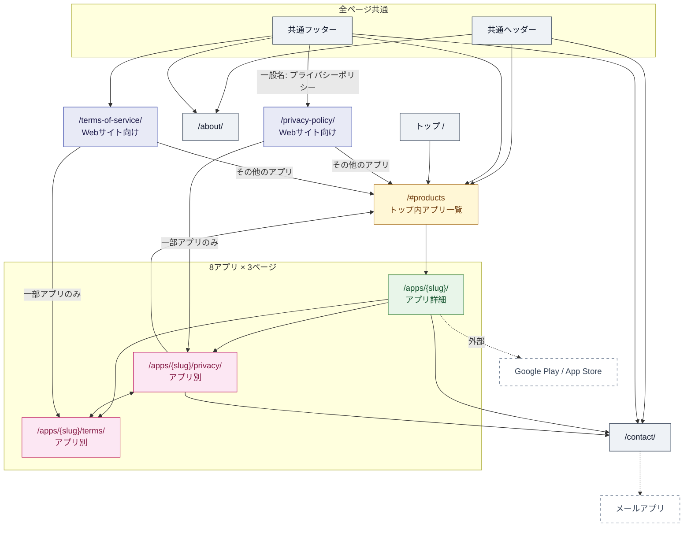
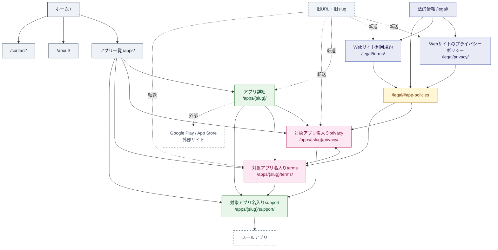

# AIAutoLab Webサイト構造・導線の解析と改修

調査日: 2026-08-03  
調査基準: リポジトリ内の Next.js App Router、データ定義、共通コンポーネント、静的HTML、ビルド処理

## 1. 改修前のページ一覧

### 正規ページ

| 種別 | URL | ソース |
|---|---|---|
| 通常 | `/` | `app/page.tsx` |
| 通常 | `/about/` | `app/about/page.tsx` |
| 通常 | `/contact/` | `app/contact/page.tsx` |
| Webサイト規約 | `/privacy-policy/` | `app/privacy-policy/page.tsx` |
| Webサイト規約 | `/terms-of-service/` | `app/terms-of-service/page.tsx` |

アプリは `app/data.ts` の実データにある次の8件です。

| slug | アプリ名 | 状態 | 対応プラットフォーム |
|---|---|---|---|
| `genai-passport` | 生成AIパスポート 学習アプリ | 公開中 | Android・iOS |
| `itpass` | ITパスポート | 準備中 | Android・iOS |
| `sg` | 情報セキュリティマネジメント | 準備中 | Android・iOS |
| `fe` | 基本情報技術者 | 準備中 | Android・iOS |
| `fp1` | FP1級 | 準備中 | Android・iOS |
| `fp2` | FP2級 | 公開中 | Android |
| `fp3` | FP3級 | 公開中 | Android |
| `tableclock` | TableClock | 公開中 | Android |

各slugについて、改修前から次の3ページが存在しました。

| 種別 | URLパターン | ソース |
|---|---|---|
| アプリ詳細 | `/apps/{slug}/` | `app/apps/[slug]/page.tsx` |
| アプリ別規約 | `/apps/{slug}/privacy/` | `app/apps/[slug]/privacy/page.tsx` |
| アプリ別規約 | `/apps/{slug}/terms/` | `app/apps/[slug]/terms/page.tsx` |

したがって、正規のアプリページは24ページです。

### 改修前の別名ページ

`app/data.ts` の `slugAliases` により、次の各旧slugでも詳細・privacy・termsの3ページ、計12ページが同内容で生成されていました。正規URLへの転送ではなく、重複ページでした。

| 旧slug | 正規slug |
|---|---|
| `generative-ai-passport` | `genai-passport` |
| `it-passport` | `itpass` |
| `security-management` | `sg` |
| `fundamental-information-technology-engineer` | `fe` |

### 改修前の `.html` 互換URL

`public/` 内の静的HTMLにより、次のURLが転送ページとして存在しました。

- `/privacy-policy.html`
- `/terms-of-service.html`
- 8アプリそれぞれの `/apps/{slug}/privacy.html`
- 8アプリそれぞれの `/apps/{slug}/terms.html`

ルート直下の `index.html`、`about/index.html`、`apps/**.html`、`fp/**.html`、`tableclock/**.html` もソースには存在しましたが、GitHub Pages の公開処理は `npm run build` 後の `out/` のみを配信するため、現行ビルドでは未使用でした。

## 2. 改修前のリンクと画面遷移

### 共通リンク

| 場所 | 表示名 | 遷移先 | 種別 |
|---|---|---|---|
| ヘッダー | Products | `/#products` | ページ内アンカー |
| ヘッダー | About | `/about/` | 内部ページ |
| ヘッダー | Contact | `/contact/` | 内部ページ |
| フッター | アプリ一覧 | `/#products` | ページ内アンカー |
| フッター | AIAutoLabについて | `/about/` | 内部ページ |
| フッター | お問い合わせ | `/contact/` | 内部ページ |
| フッター | プライバシーポリシー | `/privacy-policy/` | Webサイト規約 |
| フッター | サイト利用規約 | `/terms-of-service/` | Webサイト規約 |
| 全ページ | 本文へ移動 | `#main-content` | ページ内アンカー |

### ページ固有リンク

- トップ本文: `#products`、`/about/`、8アプリ詳細、`/contact/`
- Webサイト規約本文: 生成AIパスポートとTableClockの対応規約、および「その他のアプリ」から `/#products`
- アプリ詳細: 共通問い合わせ、当該アプリのprivacy・terms、公開中アプリのストア
- アプリ規約のサイドナビ: `/#products`、共通問い合わせ、当該アプリのprivacy・terms
- About / Contact / 各規約: `mailto:info@aiautolab.net`

### 外部リンク

| 対象 | URL |
|---|---|
| 生成AIパスポート | Google Play、App Store |
| FP2級 | Google Play |
| FP3級 | Google Play |
| TableClock | Google Play |
| アプリポリシー | Googleプライバシーポリシー、Google広告情報（旧HTMLには存在したが、改修前のNext.js版ではリンクが欠落） |

### 改修前の画面遷移図



## 3. 改修前の問題点

| 問題 | 該当箇所 | 影響 |
|---|---|---|
| 規約の対象がタイトルから分からない | `app/apps/[slug]/privacy/page.tsx`、`terms/page.tsx` の固定metadata・h1 | ブラウザtitle、OGP、h1が全アプリ同名 |
| Webサイト規約も一般名 | `app/privacy-policy/page.tsx` の「プライバシーポリシー」 | アプリ規約との違いが弱い |
| 共通フッターの対象が曖昧 | `Footer` の「プライバシーポリシー」 | アプリ規約ページからWebサイト規約へ移動することが読み取れない |
| アプリ内導線の対象が曖昧 | `LegalNav` の「サポート」「プライバシーポリシー」「利用規約」 | どのアプリのページかを導線だけで判断できない |
| パンくずがない | 全アプリ詳細・規約 | `ホーム → アプリ一覧 → アプリ → 規約` の階層が見えない |
| アプリ一覧が独立ページでない | `/#products` | 規約・サポートを含む入口として機能しにくい |
| 法的情報一覧がない | Webサイト規約本文から一部アプリのみ直リンク | 全アプリの規約を横断して探せない |
| 「その他のアプリ」の行き先が曖昧 | Webサイト規約本文の `/#products` | 表示名と遷移先の役割が一致しない |
| 同じ導線が重複 | トップの `#products`、ヘッダー、フッター、規約本文 | 入口が分散し、変更箇所が増える |
| 旧slugが重複コンテンツ | `allAppSlugs` と `getApp` | canonicalがなく、同一内容を複数URLで公開 |
| 二重管理 | ルートの旧HTML群とNext.js | 現行ビルドで未使用のソースが残り、誤修正の原因になる |
| 外部リンク表示が不統一 | ストアボタン、Googleポリシー | 外部サイトへ移動することが一部でテキスト表示されない |

孤立していた現行正規ページはありません。ただし、ルート直下の旧HTML群は現行ビルドから孤立した未使用ソースでした。

## 4. 採用した新しいサイトマップ

```text
/
├─ /apps/
│  ├─ /apps/genai-passport/
│  │  ├─ privacy/
│  │  ├─ terms/
│  │  └─ support/
│  ├─ /apps/itpass/
│  │  ├─ privacy/
│  │  ├─ terms/
│  │  └─ support/
│  ├─ /apps/sg/
│  ├─ /apps/fe/
│  ├─ /apps/fp1/
│  ├─ /apps/fp2/
│  ├─ /apps/fp3/
│  └─ /apps/tableclock/
├─ /about/
├─ /contact/
└─ /legal/
   ├─ privacy/
   └─ terms/
```

`sg`、`fe`、`itpass` はリポジトリ内の正規slugを維持しました。推測で別名へ変更しないためです。依頼例にはありませんでしたが、アプリ名を明示した問い合わせ導線を成立させるため、各アプリに `support/` を追加しました。

## 5. 改修後の画面遷移図



全アプリ詳細・規約・サポートには `ホーム ＞ アプリ一覧 ＞ アプリ名 ＞ 現在のページ` のパンくずを設置しています。

## 6. 修正対象ファイル

### 新規

- `app/apps/page.tsx`: アプリ一覧
- `app/legal/page.tsx`: 法的情報一覧
- `app/legal/privacy/page.tsx`: Webサイトのプライバシーポリシー
- `app/legal/terms/page.tsx`: Webサイト利用規約
- `app/apps/[slug]/support/page.tsx`: アプリ別サポート
- `scripts/check-static-site.mjs`: 生成HTMLのリンク・アンカー・対象名・パンくず検証
- `public/fp/*.html`、`public/tableclock/*.html`: 既知の旧URL互換

### 更新

- `app/components.tsx`: ヘッダー、フッター、パンくず、アプリ別ナビ、静的転送
- `app/data.ts`: 正規slug・別名判定
- `app/page.tsx`: `/apps/` を主導線化、旧 `#apps` アンカー維持
- `app/apps/[slug]/page.tsx`: パンくず、明確な規約・サポート導線、関連アプリ、canonical
- `app/apps/[slug]/privacy/page.tsx`: 対象名入りtitle・h1・OGP、パンくず、外部リンク
- `app/apps/[slug]/terms/page.tsx`: 対象名入りtitle・h1・OGP、パンくず、対応privacyリンク
- `app/privacy-policy/page.tsx`、`app/terms-of-service/page.tsx`: 旧ディレクトリURLの転送
- `app/globals.css`: 新規ページとモバイル表示
- `public/privacy-policy.html`、`public/terms-of-service.html`: 新しい法的情報URLへ転送
- `package.json`: サイト検証コマンド

### 削除

現行の `out/` 公開処理で未使用だったルート直下の旧HTML・旧CSS・旧JavaScript・重複画像を削除し、Next.jsと `public/` の互換ページへ一本化しました。削除内容はGit履歴から復元できます。

## 7. 実装内容

- 対象を明記したブラウザtitle、h1、OGP title
- Webサイト規約とアプリ規約を分離した法的情報一覧
- 全8アプリをデータ定義から自動表示するアプリ一覧
- アプリ詳細を起点にしたprivacy・terms・support導線
- アプリ名を含むサポートページとメール件名
- 全アプリ詳細・規約・サポートのパンくず
- フッター文言を「Webサイトのプライバシーポリシー」「Webサイト利用規約」へ変更
- 外部ストアとGoogleポリシーに外部サイト表示
- 別名slugを重複ページから正規URLへの静的転送へ変更
- 旧URL互換HTMLを維持

## 8. 変更内容の要約

アプリ導線は `/apps/`、法的情報導線は `/legal/` に集約しました。Webサイト規約とアプリ規約は名称、URL階層、パンくず、ページ内の対象ラベルで区別できます。アプリ追加時は原則として `app/data.ts` への追加だけで、一覧・詳細・規約・サポート・法的情報一覧へ反映されます。

## 9. 動作確認結果

| 確認項目 | 結果 |
|---|---|
| Next.js静的ビルド | 成功（59ルート生成） |
| 内部リンク | 生成HTML 84ファイルを検査し、リンク切れなし |
| ページ内アンカー | `#main-content`、`#products`、`#apps`、`#app-policies` を検査し、有効 |
| アプリ規約の対象名 | 全8アプリのprivacy・termsで確認 |
| パンくず | 全8アプリのprivacy・termsで機械検証。詳細・supportにも実装 |
| Webサイト規約との区別 | URL、title、h1、OGP、対象ラベル、フッター文言で区別 |
| 旧URL | 静的転送ページまたは別名slug転送を維持 |
| モバイル対応 | 760px・460px以下のレイアウト規則を実装し、静的に確認 |
| ブラウザによる視覚確認 | 実行環境のブラウザ接続制限により未実施 |

## 10. 旧URLと新URLの対応表

| 旧URL | 新URL | 方式 |
|---|---|---|
| `/privacy-policy/` | `/legal/privacy/` | 静的転送 |
| `/privacy-policy.html` | `/legal/privacy/` | 互換HTML |
| `/terms-of-service/` | `/legal/terms/` | 静的転送 |
| `/terms-of-service.html` | `/legal/terms/` | 互換HTML |
| `/apps/{正規slug}/privacy.html` | `/apps/{正規slug}/privacy/` | 互換HTML |
| `/apps/{正規slug}/terms.html` | `/apps/{正規slug}/terms/` | 互換HTML |
| `/apps/generative-ai-passport/` | `/apps/genai-passport/` | 静的転送 |
| `/apps/it-passport/` | `/apps/itpass/` | 静的転送 |
| `/apps/security-management/` | `/apps/sg/` | 静的転送 |
| `/apps/fundamental-information-technology-engineer/` | `/apps/fe/` | 静的転送 |
| 上記4旧slugの `privacy/` | 対応する正規slugの `privacy/` | 静的転送 |
| 上記4旧slugの `terms/` | 対応する正規slugの `terms/` | 静的転送 |
| `/fp/` | `/apps/fp1/` | 互換HTML |
| `/fp/privacy.html` | `/apps/fp1/privacy/` | 互換HTML |
| `/fp/terms.html` | `/apps/fp1/terms/` | 互換HTML |
| `/tableclock/` | `/apps/tableclock/` | 互換HTML |
| `/tableclock/privacy.html` | `/apps/tableclock/privacy/` | 互換HTML |
| `/tableclock/terms.html` | `/apps/tableclock/terms/` | 互換HTML |

静的ホスティングを維持するため、サーバー側のHTTP 301/308ではなく、canonical付きの静的転送を採用しています。
